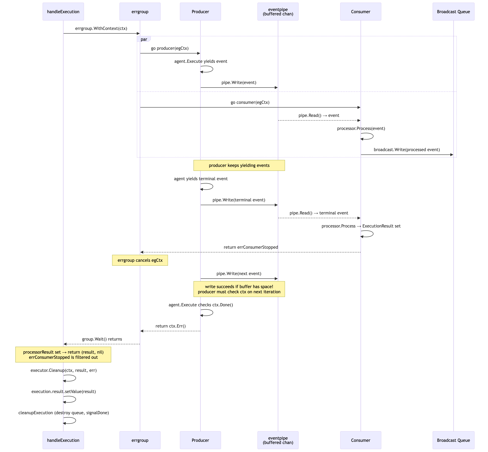
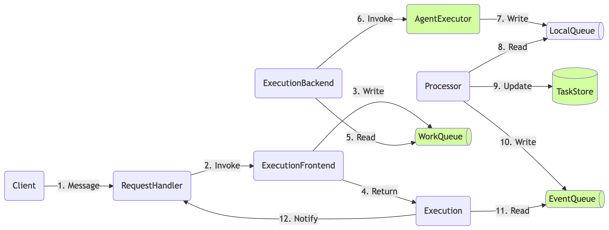
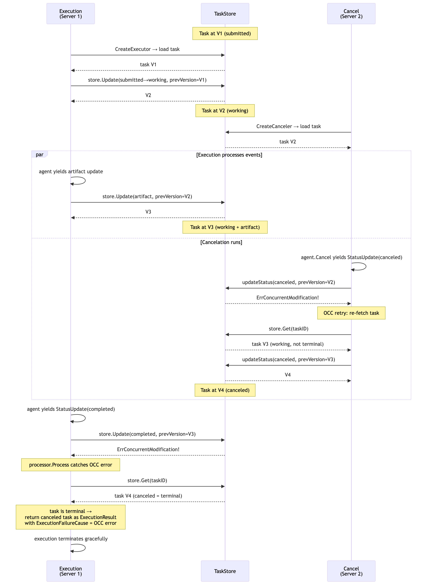

# Request Processing and Execution Flow

> **Staleness warning**: if anything described here contradicts observed behavior, re-read
> the source code. This document may be out of date.

This document describes how the server processes `SendMessage`, `SendStreamingMessage`, and `CancelTask` requests. Understanding this flow is critical for debugging race conditions, deadlocks, and state inconsistencies.

## Architecture Overview

Request handling follows a layered pipeline:

```
HTTP Request
  -> RequestHandler (a2asrv/handler.go)
    -> Manager (internal/taskexec/)
      -> Factory (a2asrv/agentexec.go)
        -> Executor/Canceler + Processor (producer-consumer pair)
          -> AgentExecutor (user code)
          -> TaskUpdate Manager (internal/taskupdate/manager.go)
            -> TaskStore (a2asrv/taskstore/)
```

The Manager is either a `localManager` (default, single-process) or a `distributedManager` (cluster mode, enabled via `a2asrv.WithClusterMode`). Both implement the same `Manager` interface and use the same `Factory`, `Processor`, and producer-consumer pipeline underneath.

The central design pattern is **producer-consumer**: the agent produces events, and the processor consumes them in a separate goroutine, persisting state changes to the task store. Events only reach subscribers after successful processing.

## Key Components

### Factory (`a2asrv/agentexec.go`)

The `factory` struct creates matched pairs of producers and consumers:

- **`CreateExecutor`** (line 139): loads or creates a task from the store, appends the user message to history, and returns an `executor` + `processor` pair.
- **`CreateCanceler`** (line 252): loads the task from the store, validates it's in a cancelable state, and returns a `canceler` + `processor` pair.

Both methods load the task from the store at creation time. The version number at load time becomes the baseline for optimistic concurrency control (OCC).

The factory is used identically by both local and distributed modes.

### eventpipe (`internal/eventpipe/local.go`)

A buffered channel connecting the producer goroutine to the consumer goroutine. Always in-process, even in cluster mode. Important properties:

1. **Write** uses a `select` on the channel send, a close signal, and context cancellation (`pipeWriter.Write`, line 87).
2. **Read** allows draining buffered events even after the pipe is closed (`pipeReader.Read`, line 112).
3. **Close** only closes the writer side. Readers can still drain remaining events.

Because the buffer is large, writes almost never block. This means a canceled context won't interrupt a write to a non-full pipe -- the write succeeds immediately and the producer loops back to generate the next event.

### eventqueue (`a2asrv/eventqueue/`)

A fan-out broadcast system for delivering processed events to subscribers. In local mode, the in-memory implementation uses a broker goroutine per TaskID with buffered channels. In cluster mode, an externally-provided implementation (e.g., database-backed) distributes events across processes.

Key behaviors of the in-memory implementation:
1. The broker goroutine fans out each event to all registered reader queues.
2. **Write is synchronous** -- it blocks until all registered queues receive the message (via a `dispatched` channel). A slow subscriber blocks the pipeline.
3. Each reader queue has a buffered channel (default 32 capacity).

### promise (`internal/taskexec/promise.go`)

A one-shot result container used for execution and cancelation results. Multiple goroutines can call `wait()` concurrently. The happens-before guarantee works because `setValue`/`setError` is always called before `signalDone` (which closes the channel), and channel close provides the memory barrier.

### Subscription (`internal/taskexec/subscription.go`)

There are two subscription types:

**`localSubscription`** (used by `localManager`): reads from the eventqueue reader and yields events. Key behaviors:
- Skips events with version <= previously emitted version (dedup for resubscription).
- Returns immediately when it receives a final event (`IsFinal`).
- **Fallback**: after the queue is closed (execution cleanup), it calls `execution.result.wait(ctx)` to yield the final result. This handles cases where the terminal event wasn't broadcast (e.g., producer panic).

**`remoteSubscription`** (used by `distributedManager`): similar but always starts with a task snapshot from the store and has **no promise fallback** since the execution may be on a different node. On queue read errors, it returns the error directly.

## Local Mode

Default mode when `WithClusterMode` is not passed. The `localManager` (internal/taskexec/local_manager.go) coordinates execution and cancellation within a single process. It tracks active executions and cancelations in mutex-protected maps and enforces rules like rejecting concurrent executions for the same TaskID and coalescing duplicate cancel calls.

### Execution Flow (`SendMessage` / `SendStreamingMessage`)

#### Step 1: Request Validation

`handler.handleSendMessage` (handler.go:348) validates the request and calls `execManager.Execute`.

#### Step 2: Execution Creation

`localManager.Execute` (local_manager.go:139):

1. Generates a `TaskID` if not provided by the client.
2. Under mutex: checks no concurrent execution/cancelation exists, acquires concurrency quota, registers the execution.
3. Creates a broadcast queue writer and a default subscription reader via `queueManager`.
4. **Detaches context** with `context.WithoutCancel(ctx)` -- the execution outlives the HTTP request.
5. Launches `handleExecution` in a goroutine.
6. Returns a `localSubscription` to the caller.

The detached context is critical: even if the client disconnects, the execution runs to completion. The execution result is stored in the task store regardless of client presence.

#### Step 3: Producer-Consumer Pipeline

`handleExecution` (local_manager.go:240) sets up and runs the pipeline:

1. Calls `factory.CreateExecutor` to get the `executor` and `processor`.
2. Constructs an `executionHandler` bridging: `eventpipe.Reader` -> `processor.Process` -> `eventBroadcast`.
3. Calls `runProducerConsumer`.

`runProducerConsumer` (execution_handler.go:85) uses `errgroup.WithContext`:

**Producer goroutine** (line 110):
- Calls `executor.Execute(ctx, pipe.Writer)`.
- The executor iterates over `agent.Execute(ctx, execCtx)` (the user's `AgentExecutor`) and writes each event to the pipe.
- Has panic recovery.

**Consumer goroutine** (line 128):
- Calls `handler.processEvents(ctx)`.
- In a loop: reads events from the pipe, calls `processor.Process` for each, writes processed events to the broadcast queue.
- When `ProcessorResult.ExecutionResult` is set (terminal event), returns `errConsumerStopped` to cancel the producer context.
- Has panic recovery.

**How they interact:**
- If the producer panics or returns an error, the errgroup cancels the shared context, which causes `pipe.Read` in the consumer to return `ctx.Err()`.
- If the consumer determines the execution is complete, it returns `errConsumerStopped`, which cancels the producer's context. The producer should check context cancellation to stop generating events.
- `group.Wait()` blocks until both goroutines finish. **If either goroutine hangs, the entire pipeline hangs.**



[Diagram Source](../diagrams/task-execution/local/execution.mermaid)

#### Step 4: Event Processing

`processor.Process` (agentexec.go:377):

1. Delegates to `updateManager.Process(ctx, event)` to validate and persist the event.
2. Handles OCC errors from concurrent cancelation (see "OCC Error Handling in the Processor" below).
3. Sends push notifications.
4. Returns `ProcessorResult` with `ExecutionResult` set only for terminal events (`IsFinal`).

`updateManager.Process` (taskupdate/manager.go:69) handles different event types:

- **`*a2a.Task`**: the first event in an execution, validates and saves.
- **`*a2a.Message`**: only allowed as the very first event (before task is stored), returns `(nil, nil)` to signal "continue processing".
- **`*a2a.TaskStatusUpdateEvent`**: calls `updateStatus` which has the OCC retry loop.
- **`*a2a.TaskArtifactUpdateEvent`**: calls `updateArtifact` to append/replace artifact data.

Terminal state check (line 77): once a task reaches a terminal state, no further updates are allowed (except idempotent re-delivery of the same event pointer).

#### Step 5: Event Delivery

After `processor.Process` succeeds, the consumer writes the event to the broadcast queue (execution_handler.go:59-68). The `eventqueue` broker fans it out to all registered readers, including the subscription's reader. The subscription yields the event to the HTTP handler, which writes it to the response (SSE for streaming, or accumulates for non-streaming).

#### Step 6: Cleanup

`cleanupExecution` (local_manager.go:225):

1. Destroys the broadcast queue (closes broker, all readers get `ErrQueueClosed`).
2. Closes the event pipe.
3. Under mutex: releases concurrency quota, removes execution from map, calls `promise.signalDone()`.

**Order matters**: the queue is destroyed first, then `signalDone` is called. This means if the subscription reads `ErrQueueClosed` and falls back to `execution.result.wait()`, the promise might not be signaled yet. But since both happen in the same function (with signalDone shortly after queue destruction), the wait is brief.

### Cancellation Flow

There are three distinct cancellation scenarios, all handled by `localManager.Cancel` (local_manager.go:200):

**Scenario 1: Cancel with No Active Execution (`handleCancel`, line 277)**

1. Creates a new `eventpipe.Local` (separate from any execution pipe).
2. Calls `factory.CreateCanceler` -- loads the task from the store, creates a `canceler` + `processor`.
3. Constructs an `executionHandler` with a passthrough `handleEventFn` (unlike execution which sets it to `processor.ProcessError`).
4. Runs `runProducerConsumer` with the canceler as producer and processor as consumer.
5. Sets the result on the cancelation promise and calls `signalDone`.

**Subtlety**: `canceler.Cancel` (agentexec.go:327) has a short-circuit: if the task loaded from the store is already in `TaskStateCanceled`, it writes the task directly to the pipe without calling `agent.Cancel`. This means the `AgentExecutor.Cancel` method is NOT called if the task is already canceled.

**Scenario 2: Cancel with Active Execution (`handleCancelWithConcurrentRun`, line 309)**

1. Creates a canceler but **no separate processor** -- the existing execution's processor handles events.
2. Calls `canceler.Cancel(ctx, run.pipe.Writer)` -- writes the cancel signal to the **same pipe** the active execution uses.
3. The execution's consumer sees the cancel event in the pipe and processes it through its own processor.
4. Waits for the execution's promise to resolve: `run.result.wait(ctx)`.
5. Copies the execution result to the cancelation result.

The cancelation result is the same as the execution result. If the execution was already completing with a different state, the cancellation might not take effect (see TODO comment at line 329-334).

**Scenario 3: Duplicate Cancel (Cancelation Already in Progress)**

Returns the same `cancelation` object (with the same promise). Does NOT launch a new goroutine. Both callers block on the same `cancel.result.wait(ctx)` and get the same result.

This coalescing only works within a single `localManager` instance (see "Multi-Instance Subtleties" below).

## Cluster Mode

Enabled by passing `a2asrv.WithClusterMode(config)` when creating the handler. The `ClusterConfig` struct (handler.go:149) requires three external dependencies:

```go
type ClusterConfig struct {
    QueueManager eventqueue.Manager  // cross-process event distribution
    WorkQueue    workqueue.Queue     // job dispatch and consumption
    TaskStore    taskstore.Store     // shared persistent state
}
```

Cluster mode splits the server into two logical roles:

1. **Frontend** (`distributedManager`): handles incoming HTTP requests. Validates parameters, writes work payloads to the work queue, creates event queue readers, and returns `remoteSubscription`s. Does NOT run agent logic.

2. **Backend** (`workQueueHandler`): registered as the handler on the work queue. When a job is dequeued, it runs the same producer-consumer pipeline as local mode: invokes the agent via `Factory`, processes events, stores results, and broadcasts events via `eventqueue.Writer`.

Both roles can run in the same process or on separate nodes.



[Diagram Source](../diagrams/task-execution/cluster/execution.mermaid)

### Work Queue (`a2asrv/workqueue/`)

The work queue abstraction has two main components:

**`Writer` interface** (queue.go:54): `Write(ctx, *Payload) (TaskID, error)` -- submits a job. The `Payload` struct contains the type (`"execute"` or `"cancel"`), TaskID, and the original request.

**`Queue` interface** (queue.go:64): embeds `Writer` and adds `RegisterHandler(HandlerConfig, HandlerFn)` -- registers the backend handler that processes dequeued jobs.

Two built-in queue patterns:

**Pull queue** (`pullqueue.go`): `RegisterHandler` starts a background goroutine that polls `ReadWriter.Read()` in a loop. When a message arrives, it dispatches work in a new goroutine. Handles retries with exponential backoff, malformed payload detection, and heartbeat attachment. After the handler returns, calls `msg.Complete()` (success) or `msg.Return()` (failure, re-enqueue). The `Message` interface (pullqueue.go:29) provides `Payload()`, `Complete(ctx)`, and `Return(ctx, error)`.

**Push queue** (`pushqueue.go`): `NewPushQueue(writer)` returns `(Queue, HandlerFn)`. The caller provides a `Writer` for submitting work. The returned `HandlerFn` should be called by the external system (e.g., a load balancer) when it assigns work to this node.

### Distributed Execution Flow

`distributedManager.Execute` (distributed_manager.go:73):

1. Generates `TaskID`.
2. Writes a `Payload{Type: "execute", TaskID: tid, ExecuteRequest: req}` to the work queue.
3. Creates an event queue reader via `queueManager.CreateReader`.
4. Returns a `remoteSubscription` -- the client reads events from here.

On the backend side, `workQueueHandler.handle` (work_queue_handler.go:49) picks up the job:

1. Creates `eventpipe.Local`.
2. Calls `factory.CreateExecutor` (same as local mode).
3. Creates `eventqueue.Writer` via `queueManager.CreateWriter`.
4. Runs `runProducerConsumer` with an optional heartbeater goroutine (if the work queue message implements `Heartbeater`).
5. On completion, the work queue message is completed or returned.

The event flow through the pipeline is identical to local mode. The difference is that the `eventqueue.Manager` must be backed by an external system (e.g., database) so the frontend node can read events produced by the backend node.

### Distributed Cancellation Flow

`distributedManager.Cancel` (distributed_manager.go:123):

1. Loads the task from the store and validates it's cancelable.
2. Writes a `Payload{Type: "cancel"}` to the work queue.
3. Creates a `remoteSubscription` and iterates events until it finds a terminal event.
4. Returns the terminal task, or on error falls back to loading the latest task from the store.

Unlike `localManager`, there is no in-process coalescing of duplicate cancels, no check for active executions, and no promise-based result sharing. The work queue and OCC handle coordination.

### Heartbeating

For long-running executions in cluster mode, `runProducerConsumer` starts an optional heartbeater goroutine (execution_handler.go:94) that periodically calls `heartbeater.Heartbeat(ctx)`. This keeps the work queue message alive (e.g., extends a visibility timeout) so the job isn't reassigned to another worker. The heartbeater is attached to the context by the pull queue (pullqueue.go:104) if the `Message` implementation supports it.

### What Must Be Externally Provided

In cluster mode, these components need external backing:

- **`taskstore.Store`**: shared persistent storage (e.g., MySQL, PostgreSQL). Must support OCC via `PrevVersion`.
- **`eventqueue.Manager`**: cross-process event distribution. The writer is often a no-op if events are written through the task store (e.g., MySQL-backed event table). The reader polls the backing store.
- **`workqueue.Queue`**: either a pull-based queue (SDK polls) or push-based queue (external system dispatches). Must handle message acknowledgement, retry, and optionally heartbeating.

See `examples/clustermode/` for a MySQL-backed reference implementation.

## Optimistic Concurrency Control (OCC)

### How OCC Works

The task store uses version numbers for optimistic concurrency control. Every `store.Update` call includes a `PrevVersion` -- the version the caller last saw. If the stored version differs, `ErrConcurrentModification` is returned.

`inmemory.go` Update (line 138):
```
if req.PrevVersion != TaskVersionMissing && stored.version != req.PrevVersion {
    return TaskVersionMissing, ErrConcurrentModification
}
```

### OCC Retry Loop for Cancellation (`updateStatus`, taskupdate/manager.go:159)

When updating task status to `TaskStateCanceled` and hitting `ErrConcurrentModification`:

1. Re-fetches the task from the store.
2. If the task is already canceled: returns the stored task (success -- someone else canceled it).
3. If the task is in a different terminal state: returns error (too late to cancel).
4. Otherwise: retries the update with the new version, up to `maxCancelationAttempts` (10).

This retry loop ONLY applies to cancelation status updates. Other status updates (completed, failed, etc.) do not retry on OCC conflicts.

### OCC Error Handling in the Processor (agentexec.go:380)

When `processor.Process` receives `ErrConcurrentModification` from the update manager:

1. Re-fetches the task from the store.
2. If the task reached a terminal state (e.g., canceled by a concurrent operation): returns the terminal task as `ExecutionResult` with `ExecutionFailureCause` set to the OCC error.
3. If the task is not terminal: returns an error indicating parallel active execution.

This is how a running execution discovers that its task was canceled by a concurrent `CancelTask` call. The execution sees the OCC conflict, loads the canceled task, and terminates gracefully.

### OCC Timeline: Concurrent Execution and Cancellation



[Diagram Source](../diagrams/concurrency_control.mermaid)

## Multi-Instance Subtleties

When multiple server instances share a `taskstore.Store` but have separate `localManager` instances (common in tests and horizontal scaling with local mode):

1. **Cancelation coalescing does NOT work across instances.** Each has its own `cancelations` map. Two cancel requests hitting different instances create independent cancelations.

2. **Execution tracking is per-instance.** A cancel request hitting an instance that doesn't own the execution will take the `handleCancel` path (no concurrent execution), not `handleCancelWithConcurrentRun`.

3. **OCC is the shared safety mechanism.** When independent cancelations on different instances race to update the same task, OCC prevents conflicting writes. The retry loop ensures one succeeds and the other discovers the already-canceled state.

4. **The `canceler.Cancel` short-circuit matters.** If Cancel A on instance 1 completes and persists `TaskStateCanceled` before Cancel B's `CreateCanceler` on instance 2 loads the task, then B's canceler sees the task is already canceled and short-circuits (agentexec.go:328-329). **This means `AgentExecutor.Cancel` is never called for B.** Test synchronization mechanisms that depend on the agent's Cancel being called for every cancel request will break in this scenario.

## Context Lifecycle

### Detached Execution Contexts

In local mode, both `Execute` and `Cancel` detach from the request context using `context.WithoutCancel(ctx)` before spawning goroutines. This means:

- Client disconnection does NOT cancel the execution.
- The execution runs to completion and persists its result.
- Server shutdown does NOT cancel detached executions (unless the server explicitly manages this).

In cluster mode, the frontend does not spawn execution goroutines. The backend's work queue handler manages the context lifecycle.

### errgroup Context in runProducerConsumer

`errgroup.WithContext(ctx)` creates a derived context that is canceled when any goroutine returns a non-nil error. Key implications:

- **Producer returns nil**: the errgroup does NOT cancel the context. The consumer continues reading from the pipe.
- **Consumer returns `errConsumerStopped`**: the errgroup cancels the context. The producer should notice via `ctx.Done()` or pipe write failures.
- **Pipe reads with canceled context**: `pipeReader.Read` returns `ctx.Err()`.
- **Pipe writes with canceled context**: `pipeWriter.Write` returns `ctx.Err()` only if the channel send would block. If the buffer has space, the write succeeds despite context cancellation.

## Common Pitfalls In Tests

1. **Assuming `AgentExecutor.Cancel` is always called**: the canceler short-circuits if the task is already canceled when loaded from the store (agentexec.go:328). This affects test synchronization.

2. **Assuming channel range loops respect context**: a `for event := range channel` loop does not check `ctx.Done()`. If the producer is stuck in such a loop, it won't stop when the consumer finishes, hanging `group.Wait()` and preventing cleanup.

3. **Pipe write succeeding despite canceled context**: because the pipe buffered, a write to a non-full buffer succeeds immediately even if the context is canceled.

4. **Broadcast queue write is synchronous**: `eventqueue.Writer.Write` blocks until all registered readers receive the message. A subscriber that doesn't drain its queue blocks the entire pipeline.

5. **Cancelation coalescing is per-instance**: two `localManager` instances sharing a store do NOT coalesce cancelations. Each creates independent cancelation goroutines, and OCC is the only coordination mechanism.

6. **Cleanup order in `cleanupExecution`**: the queue is destroyed before `signalDone` is called. Subscriptions that fall back to `execution.result.wait()` after seeing `ErrQueueClosed` must briefly wait for the promise to be signaled.